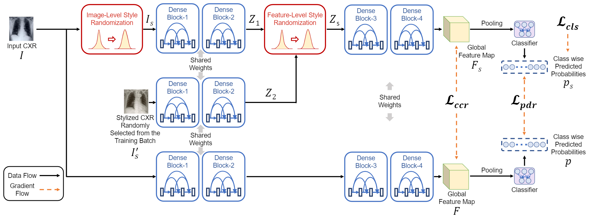

# Learning to Generalize towards Unseen Domains via a Content-Aware Style Invariant Framework for Disease Detection from Chest X-rays [[Paper](https://arxiv.org/abs/2302.13991)]



# Introduction
Performance degradation due to distribution discrepancy is a longstanding challenge in intelligent imaging, particularly for chest X-rays (CXRs). Recent studies have demonstrated that CNNs are biased toward styles (e.g., uninformative textures) rather than content (e.g., shape), in stark contrast to the human vision system. Radiologists tend to learn visual cues from CXRs and thus perform well across multiple domains. Motivated by this, we employ the novel on-the-fly style randomization modules at both image (SRM-IL) and feature (SRM-FL) levels to create rich style perturbed features while keeping the content intact for robust cross-domain performance. Previous methods simulate unseen domains by constructing new styles via interpolation or swapping styles from existing data, limiting them to available source domains during training. However, SRM-IL samples the style statistics from the possible value range of a CXR image instead of the training data to achieve more diversified augmentations. Moreover, we utilize pixel-wise learnable parameters in the SRM-FL compared to pre-defined channel-wise mean and standard deviations as style embeddings for capturing more representative style features. Additionally, we leverage consistency regularizations on global semantic features and predictive distributions from with and without style-perturbed versions of the same CXR to tweak the model's sensitivity toward content markers for accurate predictions. Our proposed method, trained on CheXpert and MIMIC-CXR datasets, achieves 77.32&plusmn;0.35, 88.38&plusmn;0.19, 82.63&plusmn;0.13 AUCs(\%) on the unseen domain test datasets, i.e., BRAX, VinDr-CXR, and NIH chest X-ray14, respectively, compared to 75.56&plusmn;0.80, 87.57&plusmn;0.46, 82.07&plusmn;0.19 from state-of-the-art models on five-fold cross-validation with statistically significant results in thoracic disease classification.

# Dependencies
- pytorch (2.0.1)
- albumentations (1.3.1)
- python (3.9.12)
- timm (0.9.2)

The code is developed in the following hardware and OS setting:
- Ubuntu 22.04.3 LTS OS
- GeForce RTX 4070 GPU
- Intel Core i7-13700KF CPU
- 32 GB System Memory

# Usage
To train the model:
```
python train.py --gpu_ids='0' --n_workers=24 --run_configs_list 'srm_il_md_chexpert_mimic' 'srm_il_fl_S1_md_chexpert_mimic' 'srm_il_fl_S2_md_chexpert_mimic' 'srm_il_fl_S2_cons_md_chexpert_mimic'
```
To test the model:
```
python test_ood.py --run_config='srm_il_fl_S2_cons_md_chexpert_mimic' --test_dataset='brax' --gpu_ids='0' --n_workers=24
```

# Citation
To cite this article in your publications, please use the following bibtex entry
```
@article{zunaed2023learning,
      title={Learning to Generalize towards Unseen Domains via a Content-Aware Style Invariant Framework for Disease Detection from Chest X-rays}, 
      author={Zunaed, Mohammad and Haque, Md. Aynal and Hasan, Taufiq},
      journal={arXiv:2302.13991},
      year={2023},
}
```

# Contact
rafizunaed@gmail.com <br>
Any discussions, suggestions and questions are welcome!

# Repo still under development
